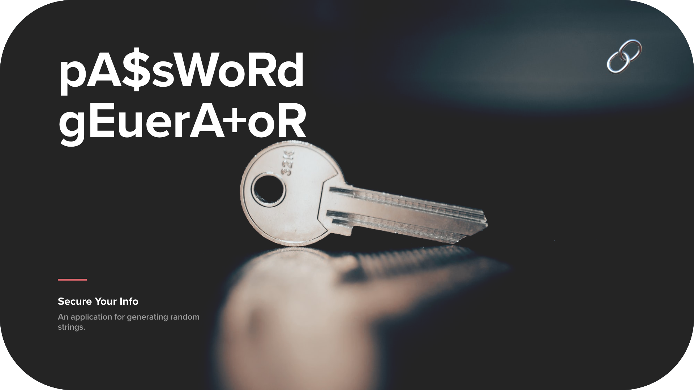
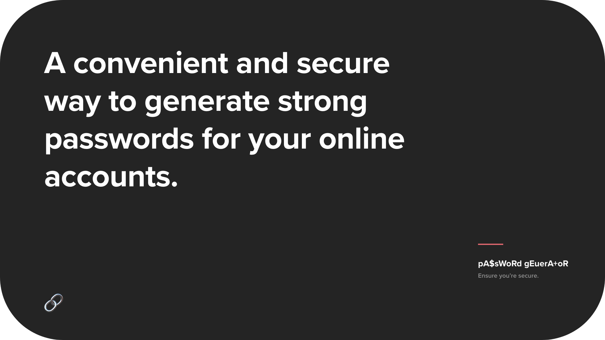
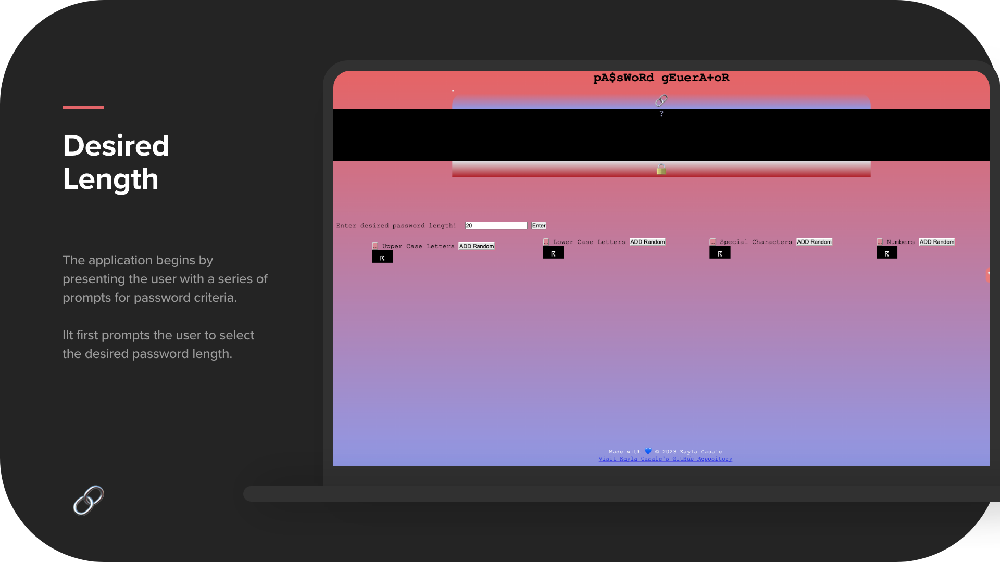
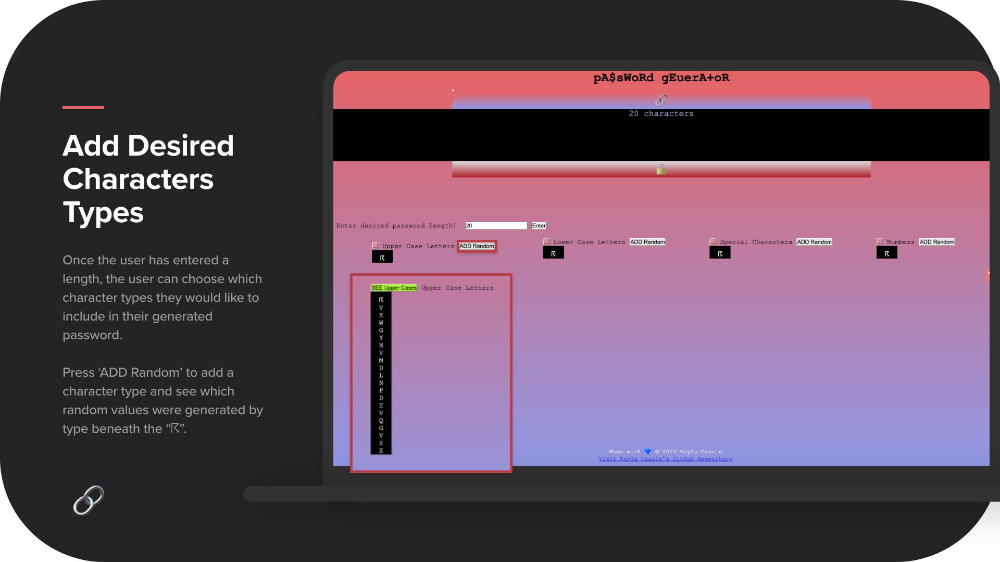
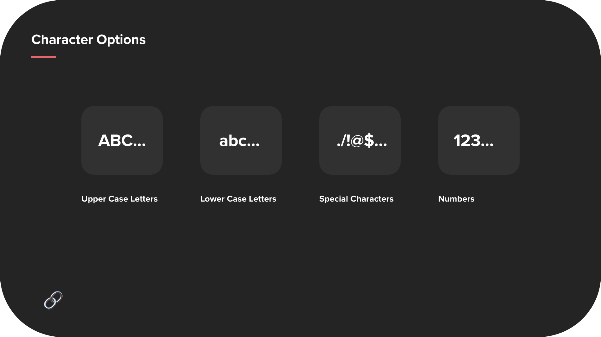
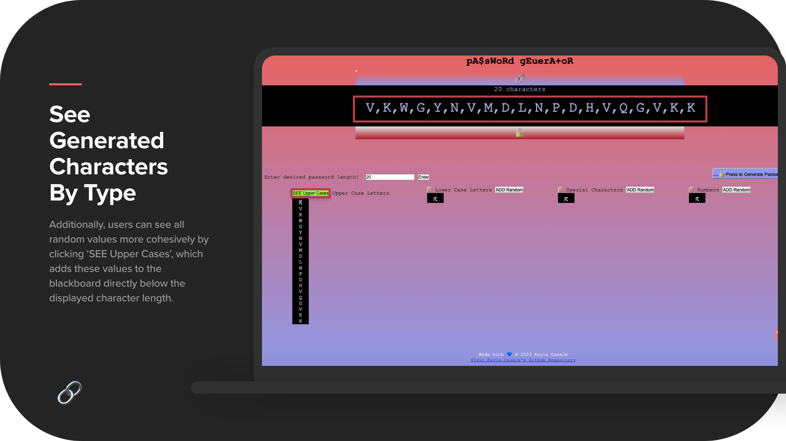
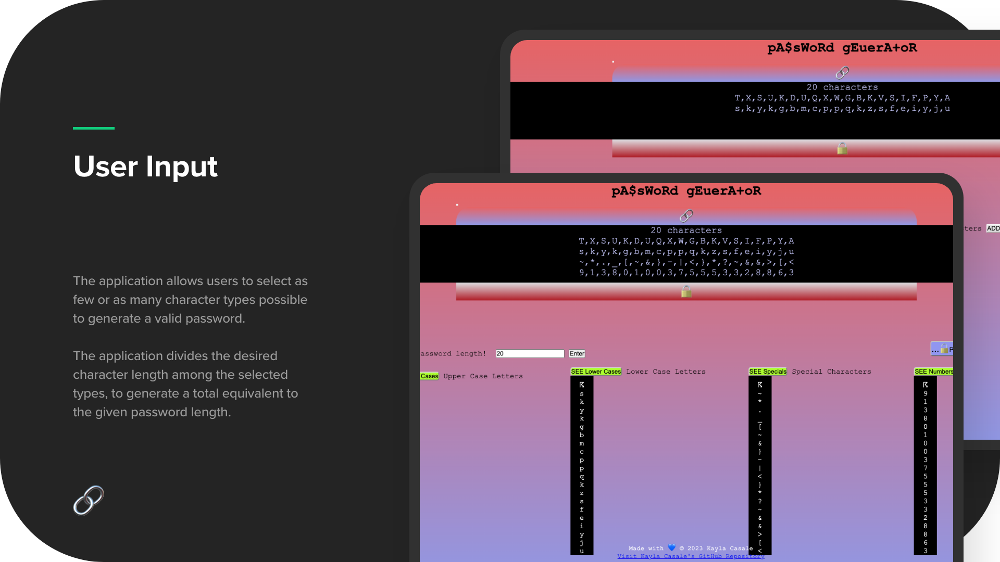
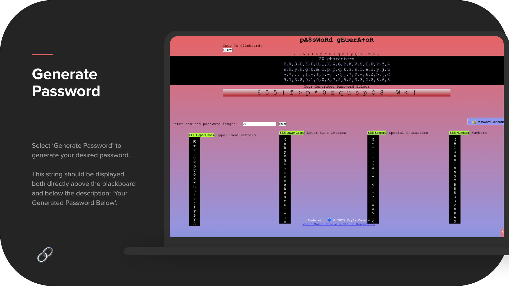
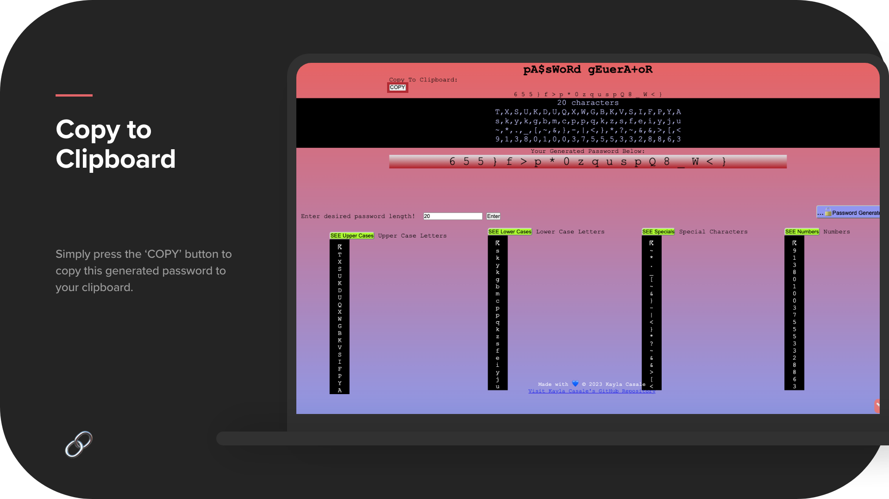
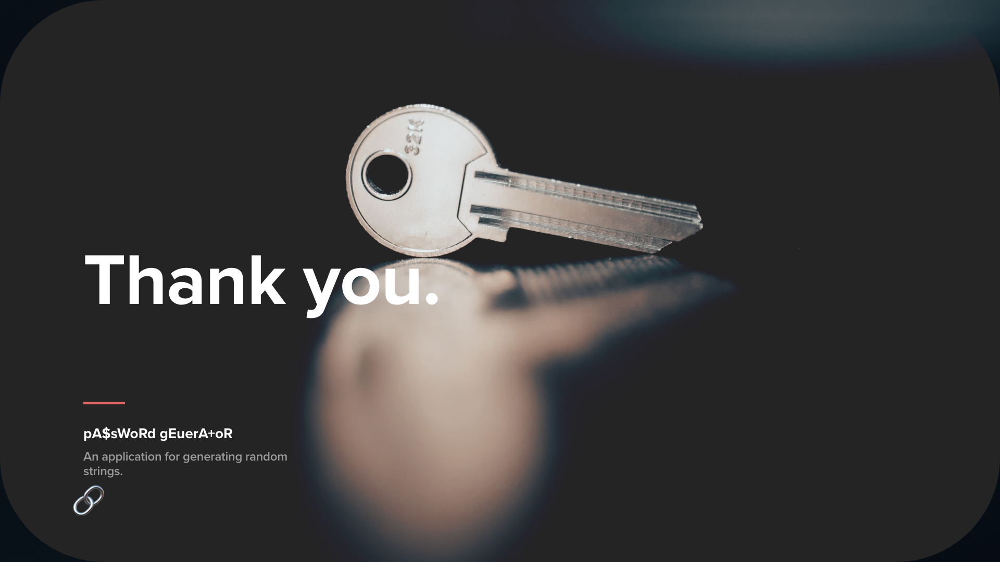

# pA$sWoRd gEuerA+oR 🔗
## generate-password
A public platform that generates a random password of desired length and character type(s).

## Installation 🔨
**Link to password generator:** https://kaylacasale.github.io/generate-password/

**Link to GitHub repository:** https://github.com/kaylacasale/generate-password

## Creation 👩🏼‍💻
I developed this web application from scratch, deciding not to refactor given starter code to allow complete control over the programming and design process while adhering to all user stories and code requirements. While this password-generator exerts true and complete randomness over which Upper Case, Lower Case, Special Character, and Numbers will be generated and included in the password, it also allows users to pick desired password lengths (the given password range is between 8 and 128 characters in length).

## Table of Contents
* [About](#about-ℹ︎)
* [Real-life Application](#real-life-application-🤝)
* [Relevant Background](#relevant-background-📝)
* [Mockup](#mock-up-🖥)
* [User Story](#user-story-📖)
* [Acceptance Criteria](#acceptance-criteria-✅)
* [Mockup](#mock-up-🖥)
* [Deck](#deck-📽)

## About ℹ︎
A password generator application is an essential tool that allows users to generate secure and unique passwords with ease. The application begins by presenting the user with a series of prompts for password criteria after clicking on the generate password button. This prompt asks the user to select the password length, character types to include in the password, and whether to include lowercase, uppercase, numeric, and/or special characters.

Once the user has selected the criteria, the application generates random variables for the desired character types. The user can see which random values were generated beneath "☈". Additionally, the user can add all random values more cohesively by clicking the "ADD Upper Case" button, which adds these values to the blackboard directly below the displayed character length.

The application validates user input and ensures that at least one character type is selected before generating a password that matches the selected criteria. Once all prompts are answered, the user can generate a password by clicking the icon "...🔓 Press to Generate Password" that will appear once at least one character type is selected. The generated password is then displayed right above the blackboard, and below "Your Generated Password Below".

Overall, the password generator application provides users with a convenient and secure way to generate strong passwords for their online accounts. By following the prompts and selecting the desired criteria, users can generate passwords that are difficult to crack, enhancing the security of their personal information.

<!--  -->

## Real-life Application 🤝
🔘 Companies that build their own portal management systems, and have password restrains on length and types of characters.

🔘 Inventory protocols that require local pins/barcodes for employee use that need to be fit on standard-sized items (e.g. computers, COVID tests, etc.). 

## Relevant Background 📝
🔘 **National Inventory Supervisor** | The Testing Co., LLC
Hired as an executive managing Operations at a healthcare startup company during a period of rapid growth- from hundreds of local patients to over 200,000+ patients across the nation. Quick data, reliable was neccessary amidst high demand and severe health concerns during the pandemic. Labels were made rapidly, and drawing barcodes during quick sampling was sometimes illegible.

## Mock-Up 🖥

## User Story 📖
AS a web developer targeting employees with access to sensitive data

I WANT to randomly generate a password

SO THAT I can create a strong password for users that provides greater security

## Acceptance Criteria ✅
GIVEN I am a user in need of a new, secure password

WHEN I click the button to generate a password

THEN I am presented with a series of propmts for password criteria

WHEN prompted for password criteria

THEN I select which criteria to include in the password

WHEN prompted for the length of the password

THEN I choose a length of at least 8 charactera and no more than 128 characters before pressing "Enter"

WHEN asked for character types to include in the password

THEN I confirm whether or not to include lowercase, uppercase, numeric, and/or special characters, by selecting the "Generate Random" button associated with each character type

WHEN I generate random variables for a desired character type

THEN I can see which random values were generated beneath "☈" 

WHEN I want to see all random values more cohesively

THEN I click the "ADD Upper Case" button to add these values to the black board directly below the displayed character length

WHEN I answer each prompt

THEN my input should be validated and at least one character type should be selected

WHEN all prompts are answered

THEN a password is generated that matches the selected criteria

WHEN I click the icon "🔓" and generate the password 

THEN the password is displayed right above the black board, in place of the icon "🔗"

## Focus Points 👾
JavaScript UI, Conditional Statements, Arrays, Iteration, Functions, Scope, Methods, Objects, Object-Methods, Traversing DOM, Setting Attributes in JS, Creating and Appending Elements, Event Listener, Preventing Default

## Deck 📽
1. 
2. 
3. 
4. 
5. 
6. 
7. 
8. 
9. 
10. 